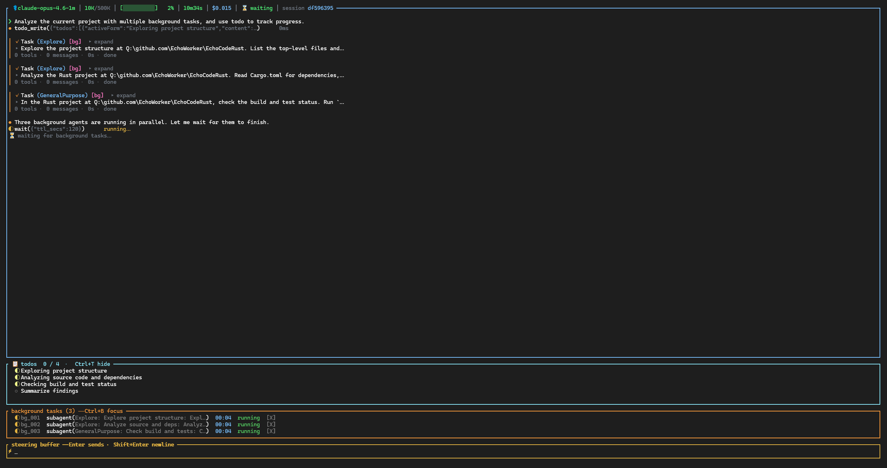

# EchoCode

**A high-performance AI coding agent written in Rust.**

EchoCode is the autonomous coding engine behind the [EchoAI](../EchoAI/) ecosystem. It connects to any LLM provider, runs an agentic tool-use loop, and executes multi-step coding tasks — reading, writing, searching, and building — all from a single binary.

<p align="center">
  
</p>

---

## ✨ Highlights

- **16+ LLM Providers** — OpenAI, Anthropic, Google, Azure, DeepSeek, Mistral, Groq, Together, Ollama, and more. Bring your own key or proxy.
- **3 API Protocols** — Chat Completions, OpenAI Responses API, and native Anthropic Messages. Auto-selected per model, zero config.
- **Multi-Tier Context Compaction** — Micro-compact (stale tool results), LLM-powered summarization, hard truncate fallback, image eviction, circuit breaker. Never lose context silently.
- **Rich Tool Suite** — 17 built-in tools: file I/O (`read`/`write`/`edit`), search (`grep`/`find`/`ls`), execution (`bash`), web (`web_fetch`/`web_search`), agent control (`subagent`/`todo`/`plan_mode`/`ask_user`), background tasks (`wait`/`cancel_background_task`).
- **Sub-Agents** — 5 specialised built-in agents (`GeneralPurpose`, `Explore`, `Plan`, `Verification`, `DeepResearch`) plus any custom agent shipped via plugin.
- **Background Tasks** — Bash auto-promotes to background after 2 min, JSONL log per task, live bar in TUI, `wait` tool blocks until a task wakes, `cancel_background_task` for graceful cancellation.
- **Skills & Plugins** — User / project / builtin skill scopes, plugin manifests, plus MCP tool servers (stdio + HTTP/SSE).
- **Hooks v2** — 12-event lifecycle hooks (`BeforePrompt`, `OnTurnEnd`, `BeforeToolCall`, …) — observe-only or decision-returning. Used by [goal-mode](docs/GOAL_MODE.md) for autonomous loops.
- **Streaming Everything** — Token-by-token LLM output, incremental tool results, real-time markdown rendering in terminal.
- **Session Persistence** — JSONL-backed conversations. Resume, replay, and repair. Context survives restarts.
- **Web Search with Fallback** — DuckDuckGo → Brave → Tavily → SearXNG. First non-empty result wins.
- **Vision** — Read images from disk and pass to vision-capable models via protocol-appropriate formats.
- **Cost Tracking** — Per-call token usage and LiteLLM-based pricing data.

---

## 📊 Evaluation

**SWE-bench Verified** — 500 real-world Python bug-fix tasks, single-turn `Pass@1`, no hints, no oracle:

| Result | Score |
|---|---|
| **Pass@1** | **449 / 500  ·  89.8 %** |
| Submitted patches | 500 / 500 |

Configuration: `anthropic/claude-opus-4.7` model + EchoCode v0.1.0 + the
[`goal-mode`](docs/GOAL_MODE.md) plugin (test-driven loop with `BeforePrompt` /
`OnTurnEnd` hooks). Top-scoring repos: matplotlib 100 % · xarray 100 % ·
sympy 96 % · scikit-learn 96.9 % · sphinx 93.2 % · django 87.4 %.

Full breakdown, failure analysis, and reproducibility instructions:
**[`docs/evaluate/swebench-verified-report.md`](docs/evaluate/swebench-verified-report.md)**.

---

## 🏗️ Architecture

```
                ┌────────────────────────────────────────────┐
                │  CLI  ─ ratatui TUI · headless · config UI │
                └────────────────────────────────────────────┘
                                    │
                ┌────────────────────────────────────────────┐
                │  Client  ─ EchoCodeClient + EchoCodeControl│
                │   sessions · prompt dispatch · cancel      │
                └────────────────────────────────────────────┘
                                    │
                ┌────────────────────────────────────────────┐
                │  Agent Loop  ─ stream → tool calls → loop  │
                │   steering · reminders · background tasks  │
                └────────────────────────────────────────────┘
                       │              │              │
        ┌──────────────┘              │              └──────────────┐
        ▼                             ▼                             ▼
┌──────────────────┐    ┌─────────────────────────┐    ┌──────────────────────┐
│  LLM             │    │  Tools (17)             │    │  Compact             │
│  ─ 3 protocols   │    │  ─ bash · read · write  │    │  ─ micro / full      │
│  ─ SSE transport │    │    edit · grep · find   │    │  ─ image strip       │
│  ─ provider reg. │    │    ls · web_* · todo    │    │  ─ hard truncate     │
│                  │    │    plan · ask · wait …  │    │  ─ circuit breaker   │
└──────────────────┘    └─────────────────────────┘    └──────────────────────┘

   ─────────────────────────────────────────────────────────────────────────
   Extensions:   Skills · Plugins · MCP servers · Hooks  (loaded at startup)
   Persistence:  Session (JSONL · resume · repair)   ·   Config (TOML)
   ─────────────────────────────────────────────────────────────────────────
```

**Key design principles:**

- **Layered separation** — CLI, client, agent core, LLM transport, and tools are independent modules with clean boundaries.
- **Async streaming throughout** — Built on `tokio` + `async-stream`. Every layer yields events incrementally.
- **Protocol abstraction** — A `Protocol` trait unifies Chat Completions, Responses API, and Anthropic Messages behind one interface. Adding a new protocol is one file.
- **Config-driven** — TOML config with global → project → env → CLI layered overrides. Deep-merge semantics.

---

## 📦 Module Overview

| Module | Purpose |
|---|---|
| `cli/` | Terminal interface — ratatui TUI (overlays, pickers, panels) + headless mode |
| `client/` | High-level orchestrator — sessions, prompt dispatch, compact triggers, `EchoCodeControl` cancellation facade |
| `core/` | Agent loop, event stream, background-task registry — the beating heart |
| `agents/` | Built-in sub-agents (5) + custom agent registry |
| `llm/` | Provider abstraction, endpoint construction, SSE transport, protocol adapters |
| `compact/` | Multi-strategy context compression (micro / full LLM-summary / image-strip / hard truncate / circuit breaker) |
| `config/` | TOML loader + global registry + per-model overrides |
| `tools/` | All 17 tool implementations the LLM can invoke |
| `session/` | JSONL conversation storage, resume, corruption repair, per-session temp dir |
| `prompt/` | Dynamic system prompt assembly with context sections |
| `permissions/` | Auto / suggest / ask modes, regex-based tool rules, `plan_mode` gating |
| `squeeze/` | Output truncation for large tool results (also reused by `bash`) |
| `skills/` | Loadable skill definitions across user / project / builtin scopes |
| `plugins/` | Plugin discovery, install/uninstall, skill+agent+hook injection |
| `mcp/` | Model Context Protocol client (stdio + HTTP/SSE transports) |
| `hooks/` | Hooks v2 lifecycle system (12 events, observe + decision modes) |

---

## 📥 Install

### One-line install (recommended)

**macOS / Linux:**
```bash
curl -fsSL https://raw.githubusercontent.com/EchoWorker/EchoAIStore/main/EchoCode/install.sh | sh
```

**Windows (PowerShell):**
```powershell
irm https://raw.githubusercontent.com/EchoWorker/EchoAIStore/main/EchoCode/install.ps1 | iex
```

### Manual download

Download archives from [Releases](https://github.com/EchoWorker/EchoAIStore/releases?q=echocode) (look for `echocode-v*` tags).

| Platform | Archive |
|---|---|
| Windows x64 | `echocode-windows-x64.zip` |
| Linux x64 | `echocode-linux-x64.tar.gz` |
| macOS ARM64 | `echocode-darwin-arm64.tar.gz` |

Extract and place `echo-code` (or `echo-code.exe`) somewhere on your `PATH`.

### Build from source

Prerequisites: Rust 1.75+ (2021 edition)

```bash
cargo build --release
./target/release/echo-code
```

> **Note:** If you use [EchoWork](../EchoWork/) (desktop IDE) or [EchoAI](../EchoAI/) (gateway), EchoCode is already bundled — no separate install needed.

---

## 🚀 Quick Start

### Configure

```bash
echo-code init        # writes a default ~/.echoai/echocode.toml
echo-code config      # interactive TUI to add providers / models
```

Or edit the TOML by hand:

```toml
model = "anthropic/claude-sonnet-4.6"

[provider]
api_key = "sk-..."

# Optional: per-provider overrides
[provider.openai]
api_key = "sk-openai-..."
base_url = "https://api.openai.com/v1"

[models."openai/gpt-4o"]
context_window    = 128000
supports_thinking = false
supports_vision   = true
```

See [CONFIG.md](docs/CONFIG.md) for the full configuration reference.

### CLI Usage

```bash
# Interactive TUI
echo-code

# Single prompt (headless)
echo-code --prompt "refactor the auth module to use JWT"

# Choose model on the fly
echo-code --model openai/gpt-5.5

# Resume the most recent session
echo-code --continue

# Specific session ID
echo-code --session 7f3a...

# Headless JSON-line output (for scripts / CI)
echo-code --prompt "..." --output json --no-tui
```

#### Management sub-commands

```bash
echo-code init                        # write default config
echo-code init --project              # write project-level .echoai/echocode.toml
echo-code init --force                # overwrite existing

echo-code config                      # 🎛 interactive TUI: providers & models
                                       #    add / edit / delete, set default model,
                                       #    atomic save preserves TOML comments

echo-code skill list                  # grouped by source (user / project / builtin)
echo-code skill install <path|url>    # install a skill pack
echo-code skill uninstall <name>      # remove a skill

echo-code plugin list                 # cards with version, path, contents
echo-code plugin install <path|url>   # install a plugin
echo-code plugin uninstall <name>     # remove a plugin
```

#### In-TUI runtime commands

```
/models              # list available models
/models <key>        # switch model
/compact             # force context compaction
/yank                # copy last assistant message to clipboard
```

Headless mode (`--prompt` / piped stdout / `--no-tui`) emits plain text
or JSONL for scripts and benchmark harnesses. See the
**[CLI TUI Capabilities](#-cli-tui-capabilities)** section below for the
full TUI surface (overlays, panels, pickers).

---

## 🔌 Supported Providers

| Provider | Protocol | Auth |
|---|---|---|
| **Anthropic** | Chat Completions / Anthropic Messages | `ANTHROPIC_API_KEY` |
| **OpenAI** | Chat Completions / Responses API | `OPENAI_API_KEY` |
| **Google / Gemini** | Chat Completions | `GOOGLE_API_KEY` |
| **Azure OpenAI** | Chat Completions | via config |
| **DeepSeek** | Chat Completions | via config |
| **Groq** | Chat Completions | via config |
| **Mistral** | Chat Completions | via config |
| **Together** | Chat Completions | via config |
| **Fireworks** | Chat Completions | via config |
| **OpenRouter** | Chat Completions | via config |
| **Ollama** (local) | Chat Completions | none |
| **Cohere** | Chat Completions | via config |
| **Hugging Face** | Chat Completions | via config |
| **Perplexity** | Chat Completions | via config |
| **xAI** | Chat Completions | via config |
| **Bedrock** | Chat Completions | via config |
| Any OpenAI-compatible | Chat Completions | `api_key` + `base_url` |

---

## 🧠 Context Compaction

EchoCode implements a sophisticated multi-tier context management system to handle long-running sessions without losing important information:

1. **Micro Compact** — Trims stale tool outputs (>5 min old) to save space incrementally.
2. **Full Compact** — When context reaches ~76% capacity, summarizes older turns via LLM while preserving recent conversation.
3. **Image Eviction** — Strips base64 images from older messages to reclaim large chunks of context.
4. **Hard Truncate** — Last-resort fallback that drops oldest messages to fit within the window.
5. **Circuit Breaker** — Prevents compact retry storms if summarization fails repeatedly.

All thresholds are configurable. Context window size auto-adjusts when switching models.

---

## 🤖 Sub-Agents

EchoCode ships **5 specialised built-in agents** the main agent can delegate to via the `subagent` tool. Each runs in its own isolated context with its own tool set.

| Agent | Purpose |
|---|---|
| `GeneralPurpose` | Generic delegated task — multi-step research, refactors, file work |
| `Explore` | Fast codebase exploration — fuzzy file search + cross-reference |
| `Plan` | Software-architect — produces step-by-step implementation plans |
| `Verification` | Post-implementation review — runs builds/tests/lints, returns PASS / FAIL / PARTIAL |
| `DeepResearch` | Multi-round web research with cross-source synthesis |

Plugins can register additional agents via their manifest. Agents emit the same event stream as the main agent (rendered as collapsible `Task` cards in the TUI).

---

## 🛠️ Background Tasks

Long-running shell commands and slow sub-agents don't have to block the agent loop:

- `bash` **auto-promotes to background** after 2 minutes (configurable). The LLM gets a `task_id` and a `log_path` it can poll.
- `bash background=true` opts in explicitly. JSONL log under `~/.echoai/tmp/<session>/`.
- The TUI shows a live **BackgroundTaskBar** with progress indicators; `Ctrl+B` to focus, `X` to cancel a row, `A` to cancel all.
- `wait` tool blocks until *any* background task finishes (or a TTL elapses) — used to interleave parallel work without polling.
- `cancel_background_task` tool gives the LLM a graceful cancellation handle.
- On reconnect, orphan PID files are cleaned and surviving tasks re-attached.

<p align="center">
  
</p>

---

## 💸 Cost & Token Monitoring

- Per-call token usage parsed from every protocol (input / output / cache_read / cache_write).
- LiteLLM pricing data shipped in `data/model_prices.json` (refreshed weekly).
- `UsageReport` event emitted after every LLM turn — includes `session_context_tokens`, `session_cost_usd`, and per-call deltas.
- TUI status bar shows live context usage (`87K/200K`) and accumulated session cost.
- Sub-agent expense rolls up into the parent session.

---

## 🪝 Hooks v2

A 12-event lifecycle hook system lets plugins observe **or modify** agent behaviour without touching core code.

**Observable events**: `BeforePrompt`, `AfterPrompt`, `BeforeLLMRequest`, `AfterLLMResponse`, `BeforeToolCall`, `AfterToolCall`, `OnTurnEnd`, `OnAgentEnd`, `OnSteering`, `OnPermissionPrompt`, `OnCompact`, `OnSessionLoad`.

**Decision hooks** can return `Allow` / `Deny` / `Modify` to gate tool calls or rewrite arguments. Shell-based hooks are supported via `command =` in the plugin manifest; native Rust hooks are registered programmatically by plugins.

The included **[`goal-mode`](docs/GOAL_MODE.md)** plugin uses `BeforePrompt` + `OnTurnEnd` to drive autonomous test-pass-or-iterate loops — this is what powers our SWE-bench 89.8 % result.

See **[`docs/HOOKS_V2.md`](docs/HOOKS_V2.md)** for the full event reference, decision protocol, and `budget-cap` example plugin.

---

## 🔧 Extending EchoCode

### Skills

Markdown-defined workflow packs the agent can invoke as a single tool. Three scopes:

```
~/.echoai/skills/                    # user — applies to every session
<workspace>/.echoai/skills/          # project — only this directory
<plugin>/skills/                     # builtin — bundled by a plugin
```

Each skill is a directory with a `SKILL.md` (YAML frontmatter + prompt template). List / install / uninstall via `echo-code skill {list,install,uninstall}`.

### Plugins

A plugin bundles skills, sub-agents, hooks, and MCP servers under one `manifest.json`. Install:

```bash
echo-code plugin install <path|git-url>
echo-code plugin list
echo-code plugin uninstall <name>
```

### MCP Servers

Connect external tool servers via the [Model Context Protocol](https://modelcontextprotocol.io/):

```toml
# stdio transport
[mcp.servers.filesystem]
transport = "stdio"
command   = "npx"
args      = ["-y", "@modelcontextprotocol/server-filesystem", "/some/dir"]

# HTTP / SSE transport
[mcp.servers.remote]
transport = "http"
url       = "https://my-mcp.example.com/sse"
```

### Hooks

Shell-based hook (simplest case):

```toml
[[hooks]]
event   = "BeforeToolCall"
tool    = "bash"
command = "echo 'about to run bash'"
```

For decision hooks and the full event list see [`docs/HOOKS_V2.md`](docs/HOOKS_V2.md).

---

## 🖥️ CLI TUI Capabilities

Running `echo-code` on a TTY drops you into a full ratatui interface:

| Surface | Trigger | What it does |
|---|---|---|
| **Status bar** | always | Model · context tokens · session id · cost — embedded in the viewport top border |
| **Welcome screen** | empty session | ASCII art + key hints |
| **Viewport** | streaming output | Markdown rendered with `syntect` syntax highlighting |
| **Multi-line input** | bottom | Shift+Enter, paste-as-attachment, UTF-8 safe cursor |
| **Steering buffer** | type while agent runs | Queued and injected as `<system_reminder>` before the next turn |
| **Todo panel** | after `todo_write` | Live progress with ✓ / ◐ / ○ glyphs; `Ctrl+T` to toggle |
| **Background task bar** | bg task starts | Live timer + state; `Ctrl+B` to focus, `X` to cancel |
| **Compacting modal** | during compaction | Centred banner with strategy + token count |
| **Plan-review overlay** | `submit_plan` tool | Two-button Approve / Reject (reason prompt on reject) |
| **Ask-user overlay** | `ask_user_question` tool | Single- or multi-select, optional free-text |
| **Model picker** | `Ctrl+M` | Fuzzy table (model · ctx · provider) |
| **Skill picker** | `Ctrl+K` | Fuzzy table, inserts `@mention` |
| **Session picker** | `Ctrl+P` | Recent sessions with age + size |
| **Slash palette** | `/` | Fuzzy command search |
| **Help overlay** | `?` | Two-column grouped key reference |
| **Config TUI** | `echo-code config` | Provider / model CRUD (separate sub-command) |

**Slash commands**: `/help` · `/clear` · `/session` · `/compact` · `/models` · `/yank` · `/exit`

**Keys** (selected): `Ctrl+C` interrupt · `Ctrl+D` exit · `Ctrl+L` clear viewport · `Ctrl+U` clear input · `g` / `G` top / bottom · `f` toggle follow · `y` yank last assistant · `Esc` cancel current overlay.

See **[`docs/CLI.md`](docs/CLI.md)** for the full reference.

---

## 🏠 Ecosystem

EchoCode is the engine layer of a 3-tier system:

| Layer | Role |
|---|---|
| **EchoCode** (this repo) | Rust agent engine — LLM, tools, compaction, sessions |
| **EchoAI** | Service layer — multi-session management, DB persistence, WebSocket API, plugin host |
| **EchoWork** | Desktop IDE — Tauri-based UI with file explorer, Git integration, chat panel, code preview |

EchoCode can run standalone as a CLI tool or be embedded as a library in EchoAI.

---

## 📄 License

AGPL-3.0
