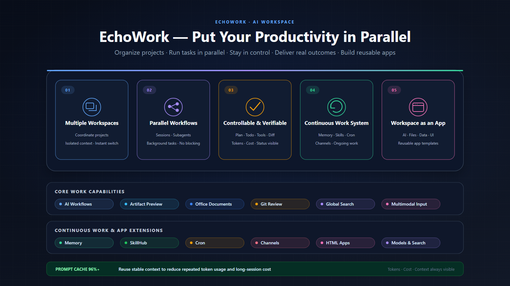

<h1 align="center">EchoWork</h1>

An open-source AI workspace for real work

<strong>English</strong> · <a href="README.zh-CN.md">简体中文</a>

  

## What makes EchoWork different?

**EchoWork is not another AI chat window. It is an AI workspace built for real work.** It uses AI to reshape your working bandwidth, so multiple tasks can move forward in parallel, keep running, and remain under your control—turning personal productivity from a single-threaded process into a parallel one.

| Core value | What it means |
| --- | --- |
| **Multiple workspaces** | Coordinate multiple workspaces from one desktop. Files, sessions, Git repositories, and project skills stay organized by project, with clean context boundaries and instant switching. |
| **Parallel workflows** | Run multiple workspaces, sessions, subagents, and background tasks at once. Each workflow stays independent, visible, and unblocked. |
| **Controllable and verifiable** | Plans, todos, tool calls, context usage, cost, and task status remain visible throughout execution. Intervene or stop at any time, then verify outcomes through real files and diffs. |
| **From conversation to continuous work** | Memory preserves project knowledge, Skills package repeatable expertise, Cron drives automation, Channels connect external entry points, and Apps provide complete experiences. |
| **Workspace as an app** | Bring UI, data, AI, and automation together in one workspace, turning personal workflows into reusable AI applications that can keep evolving and be shared as templates. |

## Capability overview

### Core capabilities

| Capability | Description |
| --- | --- |
| **AI workflows** | Run multiple sessions, subagents, and background tasks in parallel. Use Plan, Goal, and Workflow for tasks of different complexity. |
| **Execution visibility** | Track plans, todos, tool calls, context usage, token consumption, cost, and task status for every session; redirect or stop execution at any time. |
| **Token cost optimization** | Reuse stable context with Prompt Cache on supported models. Measured cache hit rates remain above **96%**, reducing repeated token consumption and long-session cost. |
| **Artifact preview** | Inspect code, Markdown, PDFs, images, audio, video, Word, Excel, PowerPoint, HTML, plans, and diffs directly in the workspace. |
| **Git workspace** | Review changes and historical diffs, manage staging, branches, and commits, and generate Conventional Commit messages. |
| **Memory** | Carry important project knowledge across sessions and retrieve past outcomes, decisions, and related files when needed. |
| **Skills** | Package expert workflows as reusable capabilities, then install, manage, and invoke them globally or per workspace. |
| **Cron jobs** | Run reports, inspections, and information gathering on a schedule while preserving the complete execution history in the bound session. |
| **Channel entry points** | Connect WeChat, Slack, webhooks, and other external requests through connectors, then manage their sessions in EchoWork. |
| **Model configuration** | Built-in support for Anthropic, OpenAI, Google Gemini, DeepSeek, Zhipu GLM, Qwen, Kimi, OpenRouter, GitHub Copilot, and local Ollama models, plus custom compatible services. Each session can choose its own model and reasoning effort. |
| **Web Search** | Give agents live web access through DuckDuckGo, Brave, Tavily, Exa, Web IQ, or self-hosted SearXNG. |

### Distinctive capabilities

| Capability | Description |
| --- | --- |
| **Screenshot annotation for AI** | Select and annotate any preview region, then send the marked screenshot and instruction directly to a vision-capable model. |
| **Background tasks within a session** | Move long-running commands and subagent work to the background so the current session remains interactive. Continue other work, monitor progress, or cancel each task independently. |
| **HTML Apps** | Let agents quickly create interactive applications connected to AI, workspace files, and persistent data for displaying, analyzing, and processing information. |
| **Safe and full webpage modes** | Unknown HTML opens safely by default. Trusted pages can opt into full webpage capabilities, retain version-specific authorization, and use developer tools. |
| **Audio transcription** | Play and visualize audio, transcribe it as a live stream, and let AI turn the result into meeting notes, interview summaries, or action items. |
| **SkillHub** | Search, filter, and inspect skill packages, install them globally or into a workspace, then invoke them explicitly with `@skill-name`. |
| **Built-in AI Apps** | Gomoku provides an AI opponent and restorable games. English Learning includes graded reading, vocabulary review, an AI teacher, conversation, and writing practice. |

## Quick command set

Type `/` in the input box to switch how the agent works. Regular chat is ideal for direct requests; use these commands when a task needs autonomous execution, coordinated delegation, continuous operation, or focused review.

### Execution commands

**`/goal <objective>` — Drive autonomously toward an outcome**

Best for tasks with a clear result but many implementation steps. The agent follows a **Plan → Work → Verify** loop instead of stopping after one response, continuing until the objective passes verification or you stop it.

**`/workflow <task>` — Coordinate multiple subagents**

Best for work that can be divided into research, implementation, testing, review, and other independent packages. The main agent manages dependencies, todos, and progress, delegates parallel work to subagents, and integrates the results.

**`/review [focus]` — Review the current changes**

Best before committing or pushing. It covers uncommitted changes and committed-but-unpushed work, then launches an isolated CodeReviewer to report findings by severity with file locations and recommended fixes.

**`/loop <recurring objective>` — Turn an objective into a continuous loop**

Best for news tracking, recurring summaries, quality checks, and continuous improvement. The agent first prepares a plan for approval, then creates a schedule so future runs continue toward the same objective with their full session context preserved.

### Session commands

**`/compact` — Compact the current session context**

When a long conversation approaches its context limit, preserve the essential task state while freeing context space. The UI updates the current context usage after compaction.

**`/clear` — Clear the current message list**

Remove the messages currently shown and return to a clean conversation view.

## HTML App: turn a workspace into an application

HTML App is one of the capabilities that most clearly separates EchoWork from ordinary AI workspaces. Describe what you need, and an agent can create an interactive interface inside the workspace that calls AI, reads and organizes files, stores state, and presents data.

A workspace can therefore become more than a container for files and conversations. It can be a dashboard, report center, knowledge browser, form, or purpose-built processing tool. Combined with workspace data, Skills, Memory, and Cron, an HTML App becomes a lightweight AI application that keeps running and evolves with your needs.

### Example: News Tracker Workspace

| Stage | How it works |
| --- | --- |
| **Collect** | Cron gathers the latest news for selected topics every day. |
| **Process** | The agent deduplicates, categorizes, summarizes, and identifies trends. |
| **Preserve** | Articles, sources, and analysis remain in the workspace. |
| **Present** | An HTML App displays the results in a searchable, filterable dashboard. |
| **Evolve** | Ask the agent to add sources, filters, charts, or new analysis dimensions at any time. |

The HTML App, data files, and project Skills can travel with the workspace folder as a reusable application template. Other users can import it, configure their own provider and data sources, recreate the scheduled jobs they need, and continue using or customizing it.

> **What you share is no longer a static result, but a working method that can run again and keep evolving.**

## Quick start

### 1. Install EchoWork

Visit the [latest release](https://github.com/EchoWorker/EchoAIStore/releases/tag/echowork-latest) and download the installer for **Windows x64** or **macOS Apple Silicon**. Release builds already include EchoAI, so no separate service deployment is required.

### 2. Connect your AI

The first-run wizard guides you through choosing a provider, entering credentials, and selecting a default model. You can connect compatible services such as OpenAI and Anthropic, or sign in with an existing GitHub Copilot entitlement. After verification, the model is available for chat, file work, audio cleanup, and HTML Apps.

### 3. Create your first workspace

Choose a local folder for the work you want to do. Good starting points include:

- research notes, meeting records, and spreadsheets;
- a Git project that needs development or review;
- a dedicated folder for reports, news tracking, or knowledge management.

EchoWork organizes files, sessions, Git, project Skills, and agent outputs around that workspace. Your source materials and generated artifacts stay in the folder you selected, ready to open and inspect.

### 4. Deliver your first result

Describe the outcome in the right-side chat without translating it into low-level commands. For example:

> **Turn the research in this workspace into a quarterly review deck. Plan the narrative first, generate the PowerPoint, and let me inspect every slide before finalizing it.**

During execution, you can inspect plans, todos, tool calls, and file changes, and add requirements at any time. When the work is complete, open the artifact in Preview and review the actual Git diff.

### 5. Start working in parallel

You do not need to wait for the first task to finish. Open another session to transcribe audio, analyze data, or modify code while the original task continues. Each workflow keeps its own status and context.

Once the basic flow feels familiar, you can also:

- install specialized capabilities from **SkillHub**;
- turn reports, inspections, and information gathering into scheduled **Cron** jobs;
- add dashboards, forms, and data-processing interfaces with **HTML Apps**;
- receive external work from WeChat, Slack, or webhooks through **Channels**.

## Feedback and license

[Report an issue or suggest a feature](https://github.com/EchoWorker/EchoAIStore/issues) · [View the latest release](https://github.com/EchoWorker/EchoAIStore/releases/tag/echowork-latest)

EchoWork is licensed under [AGPL-3.0-or-later](https://github.com/EchoWorker/EchoWork/blob/main/LICENSE).
