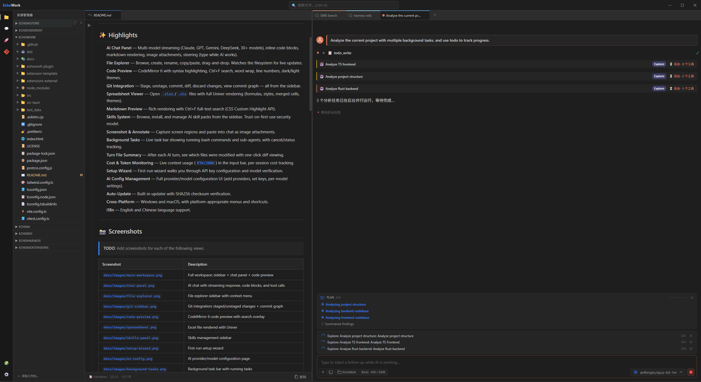
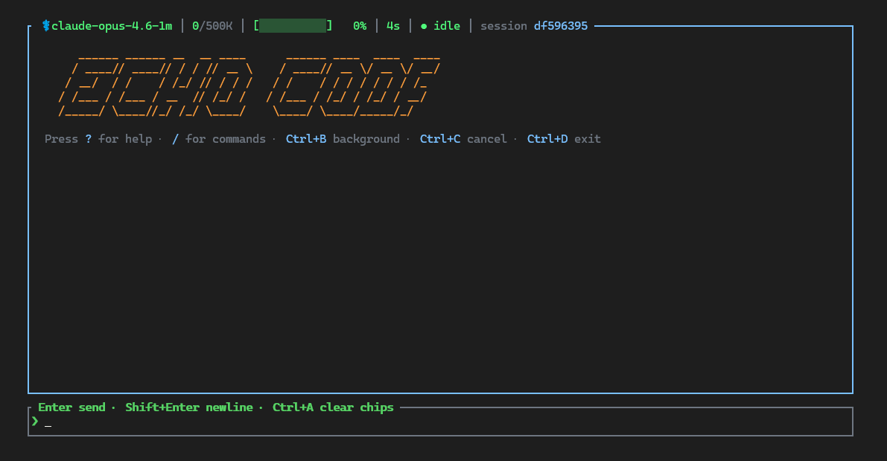

# EchoAI System

**A full-stack AI coding agent system** — from LLM engine to desktop IDE, built entirely in Rust and TypeScript.

EchoAI System is a three-layer architecture that turns any LLM into an autonomous coding agent with persistent memory, background task management, and a native desktop interface.

<p align="center">
  
</p>

---

## 🏗️ Architecture

```
┌──────────────────────────────────────────────────────────────┐
│                                                              │
│   EchoWork — Desktop AI IDE (Tauri + React)                  │
│   File explorer · Git · Chat · Code preview · Skills         │
│                                                              │
├──────────────────────────────────────────────────────────────┤
│                                                              │
│   EchoAI — Agent Gateway & Runtime (Rust)                    │
│   WebSocket JSON-RPC · Sessions · Plugins · Memory · Cron    │
│                                                              │
├──────────────────────────────────────────────────────────────┤
│                                                              │
│   EchoCode — AI Coding Agent Engine (Rust)                   │
│   LLM protocols · 17 tools · Sub-agents · Compaction · Hooks │
│                                                              │
└──────────────────────────────────────────────────────────────┘
```

Each layer is independently usable, but they're designed to work together.

---

## 📦 Projects

### [EchoCode](EchoCode/) — AI Coding Agent Engine

<p align="center">
  
</p>

A high-performance autonomous coding agent written in Rust. EchoCode is the brain of the system — it connects to any LLM, runs an agentic tool-use loop, and executes multi-step coding tasks.

**Key capabilities:**
- **16+ LLM providers** — OpenAI, Anthropic, Google, Azure, DeepSeek, Mistral, Groq, Ollama, and more
- **3 API protocols** — Chat Completions, OpenAI Responses API, Anthropic Messages — auto-selected per model
- **17 built-in tools** — file I/O, search, bash execution, web access, sub-agents, background tasks
- **5 specialised sub-agents** — GeneralPurpose, Explore, Plan, Verification, DeepResearch
- **Multi-tier context compaction** — micro-compact, LLM summarization, image eviction, hard truncate
- **Hooks v2** — 12-event lifecycle hooks for plugins to observe or modify agent behaviour
- **SWE-bench Verified: 89.8% Pass@1** — industry-leading autonomous coding performance

📖 [Full documentation](EchoCode/README.md) · 💻 [Source code](https://github.com/EchoWorker/EchoCodeRust)

---

### [EchoAI](EchoAI/) — Agent Gateway & Runtime

A multi-session, multi-client service layer that bridges any frontend to any LLM agent backend over WebSocket JSON-RPC.

EchoAI sits between client applications and agent engines. It owns session lifecycle, persistent storage, plugin hosting, memory, scheduled tasks, and a rich streaming event protocol.

**Key capabilities:**
- **WebSocket JSON-RPC gateway** — VS Code, desktop apps, CLI tools, chat bots — any client that speaks WebSocket
- **Pluggable agent backends** — EchoAgent (wrapping EchoCode) or ClaudeAgent (wrapping Claude Code)
- **Persistent memory** — Local vector search via fastembed (ONNX), 3-stage "Dreaming" consolidation
- **Plugin & tool system** — Built-in tools (messaging, email, cron, memory) plus runtime plugin injection
- **Skills management** — Install, trust-gate, and serve Markdown-defined skill packs
- **SQLite persistence** — Sessions, turns, cron jobs in WAL-mode SQLite — resume any conversation after restart
- **Cost tracking** — Per-turn token usage accumulated at session level

📖 [Full documentation](EchoAI/README.md) · 💻 [Source code](https://github.com/EchoWorker/EchoAI)

---

### [EchoWork](EchoWork/) — Desktop AI IDE

An AI-native desktop IDE built with Tauri + React. EchoWork is the visual interface for the entire ecosystem — it bundles EchoAI internally, so you just download the installer and go.

**Key capabilities:**
- **AI chat panel** — Multi-model streaming (Claude, GPT, Gemini, DeepSeek, 30+ models), markdown, code blocks, image attachments
- **File explorer** — Browse, create, rename, copy/paste, drag-and-drop with live filesystem watching
- **Code preview** — CodeMirror 6 with syntax highlighting, Ctrl+F search, themes
- **Git integration** — Stage, commit, diff, discard, commit graph — all from the sidebar
- **Spreadsheet viewer** — Open `.xlsx`/`.xls` with full Univer rendering
- **Background tasks** — Live task bar with cancel/status tracking
- **Auto-update** — Built-in updater with SHA256 checksum verification
- **Cross-platform** — Windows and macOS

📖 [Full documentation](EchoWork/README.md) · 💻 [Source code](https://github.com/EchoWorker/EchoWork)

---

## 📥 Download

### EchoWork (Desktop IDE — recommended)

The easiest way to get started. EchoAI is bundled inside — no separate install needed.

| Platform | Download |
|---|---|
| Windows x64 | [`EchoWork_*_x64-setup.exe`](https://github.com/EchoWorker/EchoAIStore/releases?q=echowork) |
| macOS Apple Silicon | [`EchoWork_*_aarch64.dmg`](https://github.com/EchoWorker/EchoAIStore/releases?q=echowork) |

### EchoAI (Standalone gateway)

For headless use, chatbots, automation, or custom integrations.

**macOS / Linux:**
```bash
curl -fsSL https://raw.githubusercontent.com/EchoWorker/EchoAIStore/main/EchoAI/install.sh | sh
```

**Windows (PowerShell):**
```powershell
irm https://raw.githubusercontent.com/EchoWorker/EchoAIStore/main/EchoAI/install.ps1 | iex
```

### EchoCode (Standalone CLI agent)

For terminal-only use or embedding in other systems.

**macOS / Linux:**
```bash
curl -fsSL https://raw.githubusercontent.com/EchoWorker/EchoAIStore/main/EchoCode/install.sh | sh
```

**Windows (PowerShell):**
```powershell
irm https://raw.githubusercontent.com/EchoWorker/EchoAIStore/main/EchoCode/install.ps1 | iex
```

### All release archives

See the [Releases](https://github.com/EchoWorker/EchoAIStore/releases) page for all platforms and versions.

| Product | Windows x64 | macOS ARM64 | Linux x64 |
|---|---|---|---|
| EchoWork | `.exe` installer | `.dmg` | — |
| EchoAI | `.zip` | `.tar.gz` | `.tar.gz` |
| EchoCode | `.zip` | `.tar.gz` | `.tar.gz` |

---

## 🔗 Source Repositories

| Project | Repository | Language | License |
|---|---|---|---|
| EchoCode | [EchoWorker/EchoCodeRust](https://github.com/EchoWorker/EchoCodeRust) | Rust | AGPL-3.0 |
| EchoAI | [EchoWorker/EchoAI](https://github.com/EchoWorker/EchoAI) | Rust | AGPL-3.0 |
| EchoWork | [EchoWorker/EchoWork](https://github.com/EchoWorker/EchoWork) | TypeScript + Rust | AGPL-3.0 |
